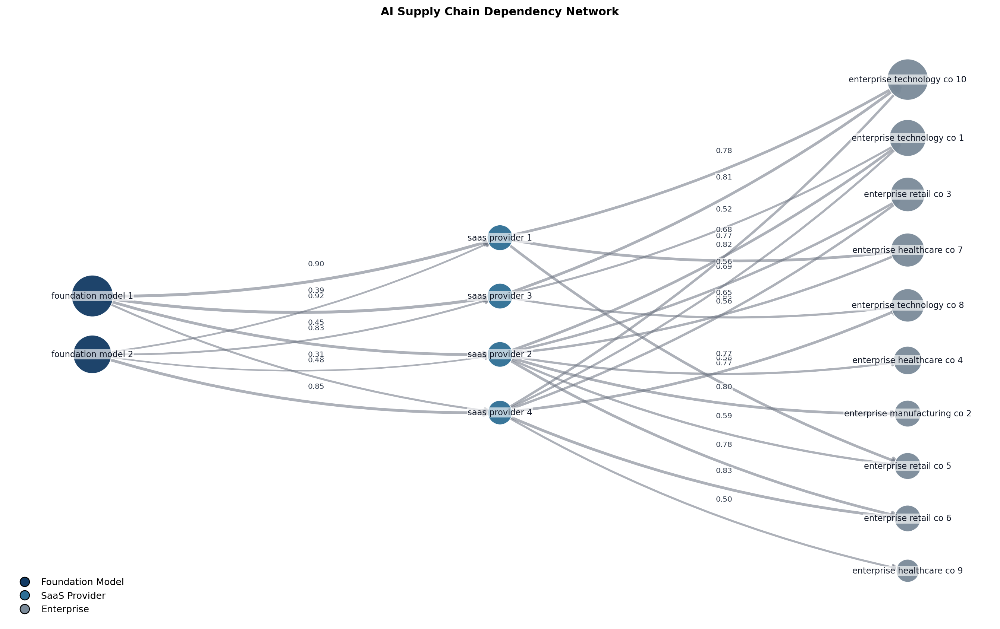

# No One Thanks You for Disasters That Never Happened: Pricing AI Risk While Making AI Safety Investable

We propose a framework for pricing AI risk under deep uncertainty, using a scenario-based frequency–severity decomposition with dependency-aware propagation and aggregation with catastrophe-style tail modeling.

AI governance Apart Hackaton, 2026.

<p align="center">
  
</p>

For more details, check the website: https://pricing-ai-risks.netlify.app/

## Overview

This model implements a complete catastrophe pricing workflow similar to those used by reinsurance analytics teams:

1. **Scenario Engine**: Defines structured AI catastrophe scenarios with frequency, severity, and propagation characteristics
2. **Frequency Model**: Poisson-based event occurrence modeling
3. **Severity Model**: Heavy-tailed loss distributions (Pareto, Lognormal) with capability-based regime switching
4. **Dependency Graph**: NetworkX-based AI supply chain modeling for systemic risk propagation
5. **Monte Carlo Engine**: Simulation generating Year Loss Tables
6. **Risk Metrics**: Standard actuarial measures (EL, VaR, TVaR)
7. **Premium Calculator**: Ambiguity-loaded pricing for parameter uncertainty
8. **Exceedance Curves**: Loss distributions

## Installation

This project uses [uv](https://github.com/astral-sh/uv) for dependency management.

```bash
git clone https://github.com/your-org/ai-risk-pricing.git
cd ai-risk-pricing
```
```bash
uv sync
uv pip install -e .
```

## Quick Start

Run the complete model with default parameters:

```bash
uv run python -m ai_risk_pricing.main --companies 20 --years 500 --output-dir ./results

# or if installed
ai_risk_pricing
```

### Command Line Options

```bash
uv run python -m ai_risk_pricing.main \
  --companies 20 \
  --years 100000 \
  --include-known-knowns \
  --include-known-unknowns \
  --dark-mode \
  --output-dir ./results \
  --show-plots \
  --seed 0102206
```

## Project Structure

```
ai_risk_pricing/
├── main.py                 # Entry point and orchestration
├── config.py               # Model configuration and parameters
│
├── scenario/
│   ├── schema.py           # Scenario dataclass definitions
│   └── generator.py        # Scenario generation (random & predefined)
│
├── modeling/
│   ├── frequency.py        # Poisson frequency model
│   ├── severity.py         # Heavy-tailed severity distributions
│   ├── dependency.py       # NetworkX dependency graph
│   └── monte_carlo.py      # Core simulation engine
│
├── portfolio/
│   ├── company.py          # Company and Portfolio dataclasses
│   └── aggregation.py      # Portfolio-to-graph aggregation
│
├── safety/
│   ├── measure.py          # Safety measure definitions and scoring
│   ├── mitigation.py       # Risk mitigation calculations
│   ├── providers.py        # AI provider safety profiles
│   └── risk_surface.py     # Risk surface modeling
│
├── visualization/
│   ├── exceedance.py       # EP curve plotting
│   ├── complementary_plots.py  # Additional risk visualizations
│   └── graph_export.py     # Dependency graph export utilities
│
└── utils/
    ├── distributions.py    # Distribution sampling utilities
    └── severity_by_framework.py  # Framework-specific severity adjustments
```

## Key Concepts

### Scenarios

Scenarios represent distinct AI failure modes:

- **Known Knowns** — MIT AI reported incidents
- **Known Unknowns** — REgulatory, policy and research frameworks


Each scenario specifies:
- Base frequency (annual event rate)
- Severity distribution (Pareto or Lognormal)
- Propagation vector (how losses spread)
- Capability threshold (regime switching point)

### Dependency Graph

The AI supply chain is modeled as a directed graph:

```
Foundation Models → SaaS Providers → Enterprises
```

<p align="center">
  
</p>

Loss propagation includes:
- **Concentration amplification**: `loss *= (1 + HHI^exponent)`
- **Criticality weighting**: High-criticality nodes amplify losses
- **Dependency weighting**: Proportional loss transmission

### Premium Formula

```
Premium = Expected_Loss 
        + ambiguity_load × TVaR 
        + expense_ratio × Expected_Loss
```

The **ambiguity load** (default 50% of TVaR) compensates for parameter uncertainty — critical for AI risks with no historical loss data.

## Example Output

```
======================================================================
AI CATASTROPHE MODEL
Reinsurance-Style Risk Pricing Engine
======================================================================

Building portfolio with 15 companies...
  Total revenue: $8,234M
  Total exposure: $4,892M
  Average AI dependency: 62.3%

Generating catastrophe scenarios...
  Generated 5 scenarios:
    - Foundation Model Critical Failure (λ=0.150, pareto)
    - Coordinated Adversarial Attack (λ=0.250, lognormal)
    - Alignment Failure Incident (λ=0.080, pareto)
    - Emergency Regulatory Shutdown (λ=0.200, lognormal)
    - AI Supply Chain Compromise (λ=0.100, pareto)

Running Monte Carlo simulation (100,000 years)...
  Simulation complete in 45.2 seconds
  Years with loss: 52,341 (52.3%)
  Mean annual loss: $127.45M
  Maximum loss: $3,892.12M

Calculating risk metrics...
  Expected Loss (EL):    $      127.45M
  VaR 99%:               $    1,245.67M
  TVaR 99%:              $    1,892.34M

============================================================
AI CATASTROPHE RISK - PREMIUM CALCULATION
============================================================

PREMIUM COMPONENTS:
  Expected Loss:             $      127.45 M
  Ambiguity Load (50% TVaR): $      946.17 M
  Expense Load (25% EL):     $       31.86 M

  TOTAL PREMIUM:             $    1,105.48 M

KEY RATIOS:
  Rate on Line (RoL):              22.60%
  Premium / EL Multiple:            8.67x
============================================================
```
